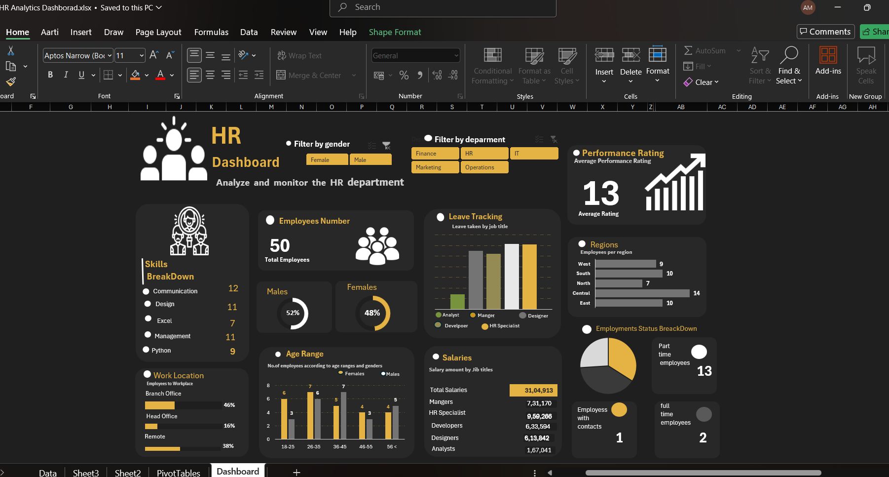

\# 📊 HR Analytics Dashboard – Excel Project

\## 👨‍💻 HR Analytics Dashboard using Microsoft Excel

\### 📌 Project Overview

This project presents an interactive HR Analytics Dashboard developed using Microsoft Excel to analyze employee data and generate meaningful workforce insights. The dashboard helps HR professionals monitor employee demographics, salary distribution, performance ratings, employment status, leave tracking, regional distribution, and skill analysis.

The objective of this project is to support data-driven HR decision-making by transforming raw employee data into visually appealing and actionable reports.

---

\## 🎯 Project Objectives

\* Analyze workforce distribution across departments and regions.

\* Monitor employee performance ratings.

\* Evaluate salary distribution across job roles.

\* Track employee leave patterns.

\* Analyze employment status and workforce demographics.

\* Identify skill distribution among employees.

\* Enable interactive dashboard filtering for detailed analysis.

\* Support strategic HR planning and workforce management.

---

\## 🛠️ Tools \& Technologies

\* Microsoft Excel

\* Pivot Tables

\* Pivot Charts

\* Slicers

\* Conditional Formatting

\* Data Cleaning

\* Dashboard Design

\* Data Visualization

---

\## 📂 Dataset Information

The dataset contains employee-related information including:

\* Employee ID

\* Gender

\* Age

\* Department

\* Job Title

\* Salary

\* Performance Rating

\* Employment Status

\* Region

\* Skills

\* Leave Information

---

\## 📈 Key Performance Indicators (KPIs)

✔ Total Employees

✔ Male Employees

✔ Female Employees

✔ Average Performance Rating

✔ Employment Status Distribution

✔ Salary Distribution

✔ Leave Tracking Metrics

✔ Regional Employee Distribution

✔ Skills Distribution

These KPIs help HR teams monitor workforce performance and organizational effectiveness.

---

\## 📊 Dashboard Insights

\### 👥 Workforce Distribution

\* Employee distribution analyzed across different departments.

\* Gender diversity tracked through Male vs Female employee counts.

\* Workforce demographics visualized through age group analysis.

\### 💰 Salary Analysis

\* Salary distribution analyzed by employee position.

\* Compensation trends identified across different job roles.

\* Supports workforce compensation planning.

\### ⭐ Performance Analysis

\* Employee performance ratings monitored across the organization.

\* Average performance score helps evaluate workforce productivity.

\* Enables identification of high-performing employee groups.

\### 🌍 Regional Analysis

\* Employee distribution compared across different regions.

\* Supports workforce planning and regional resource allocation.

\### 📋 Employment Status Analysis

\* Workforce segmented into Full-Time, Part-Time, and Contract Employees.

\* Helps monitor workforce composition and staffing patterns.

\### 🚀 Skills Analysis

Top skills identified in the workforce include:

\* Communication

\* Design

\* Excel

\* Management

\* Python

---

\## 📷 Dashboard Preview

---

\## 📁 Project Structure

HR-Analytics-Dashboard-Excel

│

├── HR Analytics Dashboard.xlsx

├── dataset.xlsx

├── dashboard\_screenshot.png

└── README.md

---

\## 💡 Business Recommendations

🔹 Focus on workforce development programs to improve employee skills.

🔹 Use performance insights to identify training opportunities.

🔹 Monitor salary trends to ensure competitive compensation.

🔹 Analyze leave patterns to improve workforce planning.

🔹 Utilize regional workforce insights for better resource allocation.

🔹 Leverage dashboard analytics for strategic HR decision-making.

---

\## 📚 Key Learnings

\* HR Data Analysis

\* Dashboard Design Principles

\* Data Cleaning and Preparation

\* KPI Development

\* Workforce Analytics

\* Data Visualization in Excel

\* Interactive Reporting

\* Business Insight Generation

---

\## 👤 Author

\### Aarti More

🎓 Bachelor of Engineering (AI\&DS)

📧 Email: aartimore445@gmail.com

🔗 LinkedIn:www.linkedin.com/in/aarti-more-data-analyst

📊 Aspiring Data Analyst

💼 Skills: Excel | SQL | Power BI | Python | Data Analytics

---

\## ⭐ Project Highlights

✅ Interactive HR Analytics Dashboard

✅ Dynamic Filtering Using Slicers

✅ Professional Dashboard Design

✅ Employee Performance Analysis

✅ Workforce Demographics Insights

✅ Salary \& Employment Analysis

✅ Real-World HR Analytics Use Case

✅ Portfolio Project for Data Analyst Roles

---

\## 📌 Conclusion

The HR Analytics Dashboard provides a comprehensive view of workforce data and enables organizations to monitor employee performance, demographics, salaries, skills, and employment trends efficiently. This project demonstrates the practical application of Microsoft Excel for HR Analytics and Business Intelligence reporting.

